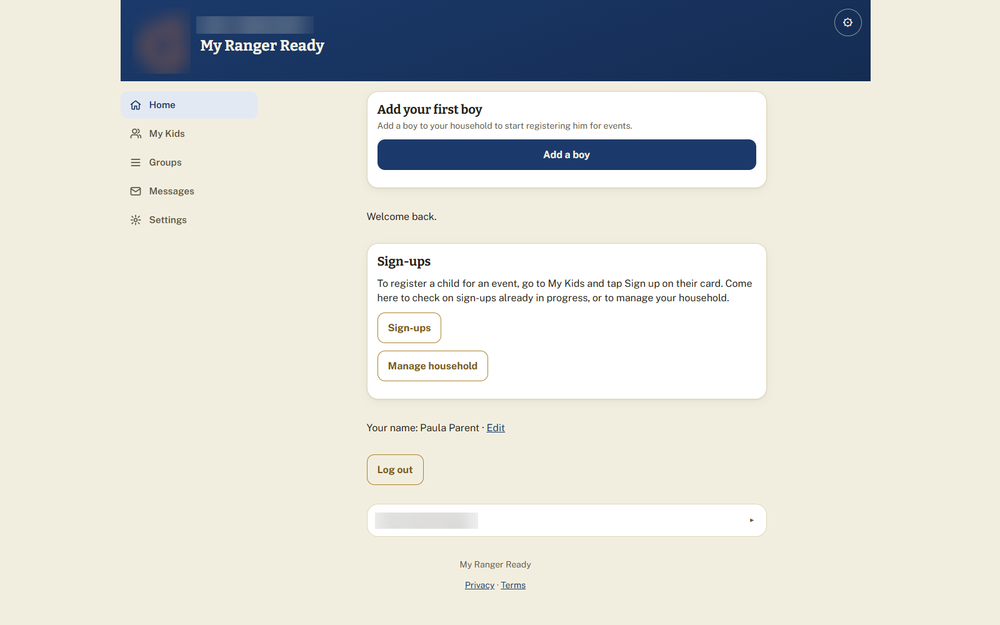
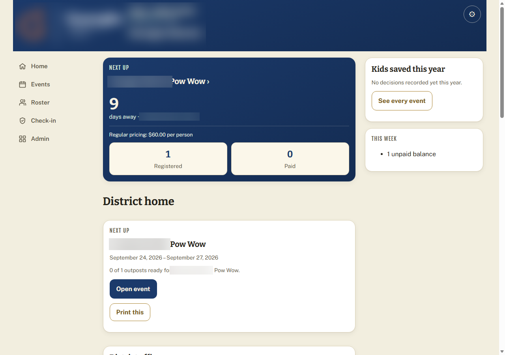
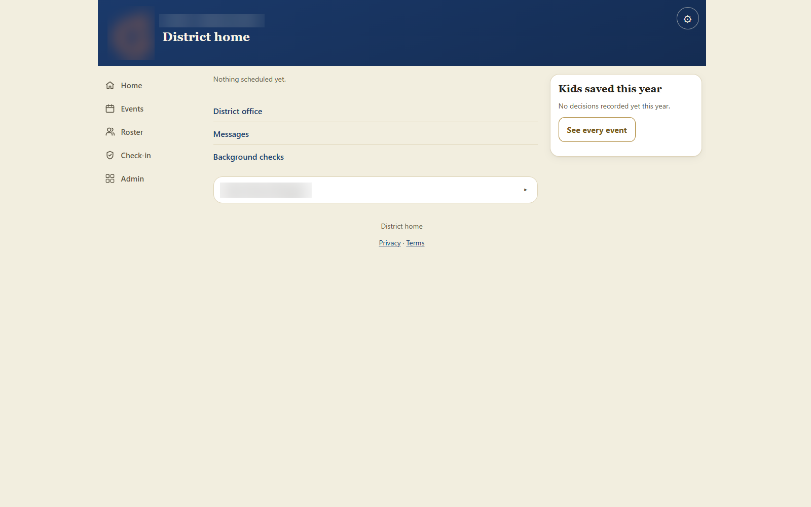
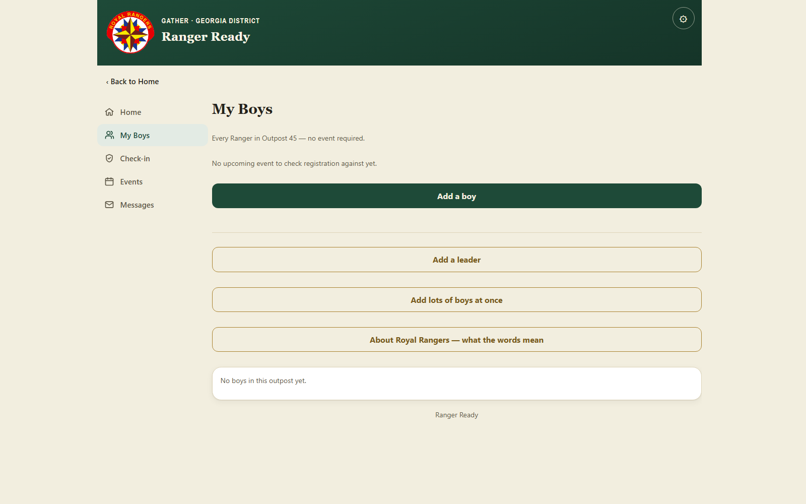
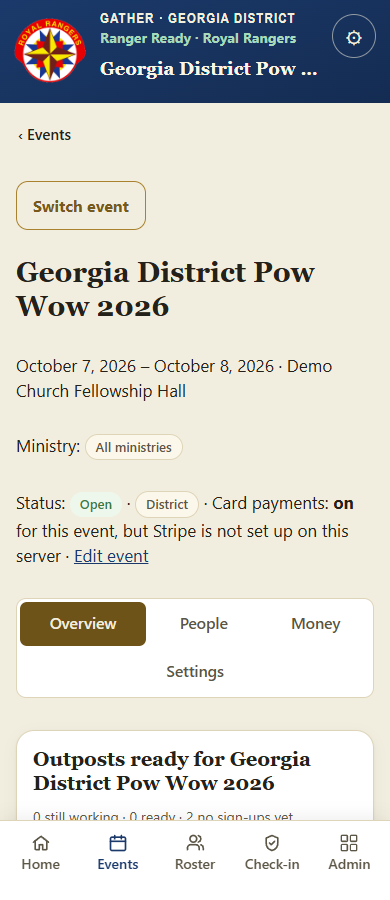
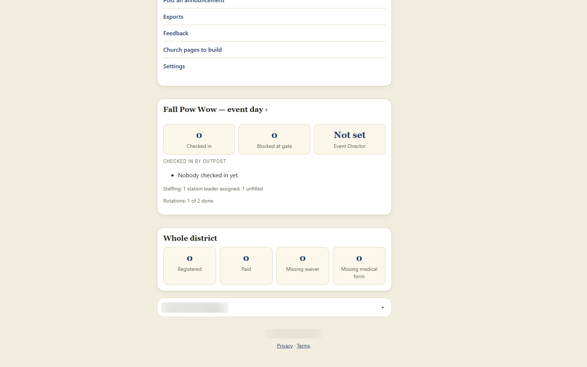
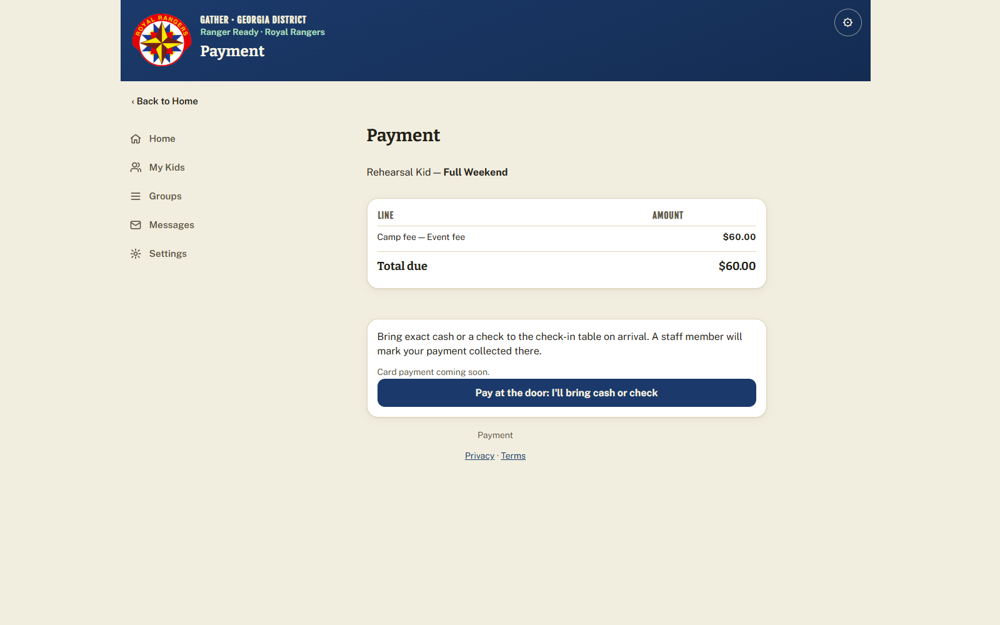
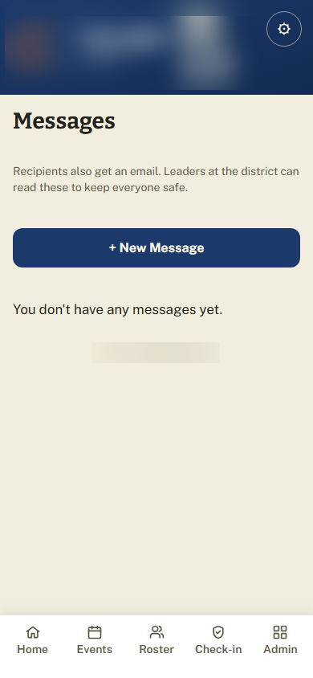
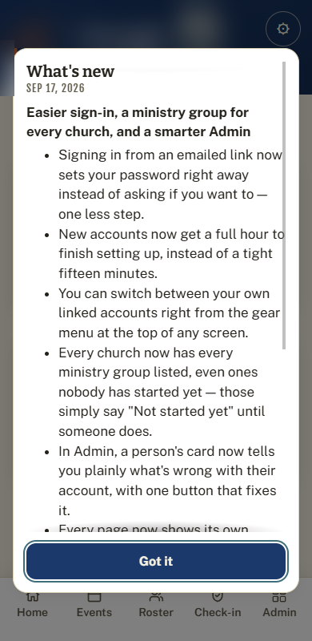

# Gather

**A church and district platform for families, volunteers, and the people who lead them.**

Gather is one app for a church family's week: checking kids in and out, serving on a team,
signing up for events and camps, paying for them, and staying in touch. It is built for
small and mid-sized churches and the district offices that oversee them: parents on a phone
in a parking lot, volunteers at a check-in table, and a district office that needs to see
every church at once.

Ranger Ready (a boys' ministry) and Girls Ministries are sections of the same app, not
separate products.

## One app, four levels

Family, church, district, national. A parent sees their own kids. A leader sees their group.
A pastor sees their church. The district office sees every church in the district.

## What it does today

- **Check-in and checkout.** Leaders check kids in and release them to an approved adult.
  It keeps working with no signal and syncs when bars come back.
- **Serving roles.** Leaders, sponsors, pastors, office staff, and district admins each get
  the screens their job needs and nothing more. Background checks are tracked per person.
- **Events and registrations.** Sessions, pricing, registration windows, waivers, medical
  forms, staffing, schedules, and a live event-day view.
- **Payments with fees shown honestly.** A parent sees every line before paying. Cards run
  through Stripe; pay-at-the-door is always an option. Tithes and offerings are designed and
  marked "coming soon", not shipped yet.
- **Messages.** Families and leaders message inside the app; recipients also get an email,
  and district leaders can read messages to keep kids safe.
- **District oversight.** Every event, every church's readiness, unpaid balances, exports,
  and announcements in one place.
- **View As for support.** A named support account can see the app exactly as another person
  does, read-only, so nobody has to share a password to get help.
- **What's New.** Every change appears in a What's New pop-up for every role at next sign-in,
  and the illustrated user manual is updated with it.

## How it is put together

- **TypeScript on Node, no framework, no npm dependencies.** Server, router, encryption, and
  database all use what ships with Node, so there is no third-party supply chain to audit.
- **One database per district.** Each district gets its own SQLite file; no table ever holds
  two districts' data. A control-plane database tracks districts and schema versions.
- **Forward-only, versioned migrations**, applied one district at a time with a dry run and
  stop-on-failure.
- **Registry-driven ministries.** A ministry is rows of data (words, colors, emblems). Adding
  one is a checklist and a conformance test, not a copied page.
- **Tests plus a browser rehearsal harness.** A large suite on Node's built-in test runner,
  and a harness that drives a real browser through whole event weekends and captures what
  each person actually sees.

### By the numbers (as of 2026-09-24)

| | |
|---|---|
| Commits on the main branch | 2,698 |
| Database migrations | 98 |
| Test files | 616 |
| HTTP routes | 396 (42 public, on an explicit allowlist) |

## Safety measures

The app holds children's names, medical notes, and family payments, so safety was the first
design constraint:

- **Medical and incident notes are encrypted per record** (AES-256-GCM envelope encryption,
  per-district keys, key versioning and rotation).
- **Districts are isolated** in separate database files, with tests that attack the boundary.
- **One authorization table** decides every permission; a snapshot test fails if it drifts.
- **Ministry separation** is scanned by tests so one ministry's data never shows on another's
  screens.
- **Sign-in is easy and hard to abuse:** emailed links and codes, lockouts an attacker cannot
  turn against a real user, hashed session tokens, MFA for roles that see medical data, and
  step-up re-authentication for sensitive actions.
- **Every form is CSRF-protected**, and a test checks every route to prove it.
- **Email links are never used up by a GET**, so a mail scanner cannot spend someone's link.
- **A strict Content-Security-Policy**, body caps, upload checks, rate limits, and redaction
  of personal data in logs.
- **A tamper-evident audit log** records who read or changed a child's record.

Full write-up: [SECURITY.md](SECURITY.md).

## How it is built

I direct an agent studio. I set the laws the product has to obey, write the rulings when a
screen is wrong, and review every screen before it ships. The code is written by AI agents
under my direction, one job at a time, each with a written brief and a narrow leash. Every
change is checked by a second agent that did not write it, by the test suite, by a
real-browser rehearsal, and then by me. When something slips through, it becomes a written
law and a test so it cannot slip through twice. I am accountable for what ships.

## Screenshots

Test data from a demo setup only. No real people or families.

| | |
|---|---|
| Parent Home  | District Home  |
| District Home, empty  | Leader roster  |
| Event on a phone  | Event-day overview  |
| Schedule, station done  | Payment  |
| Messages  | What's New  |

---

Source is private. Ask for a walkthrough.
